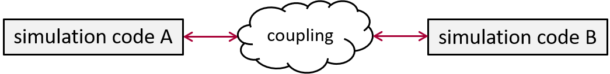
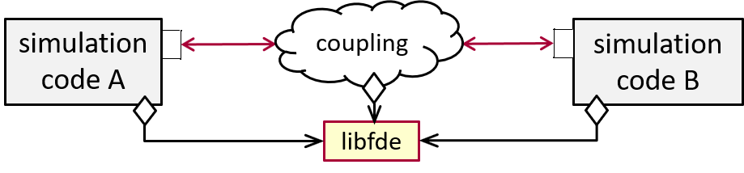
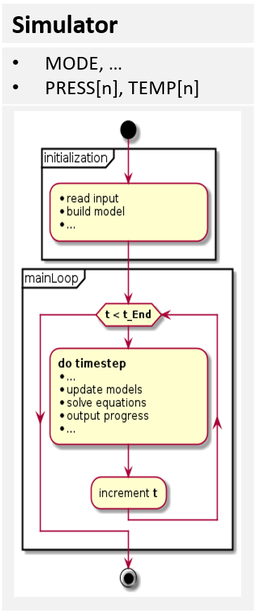
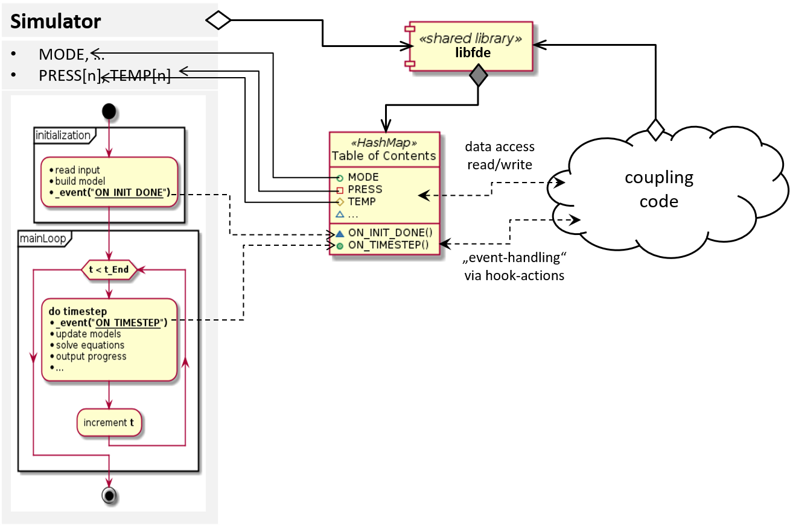
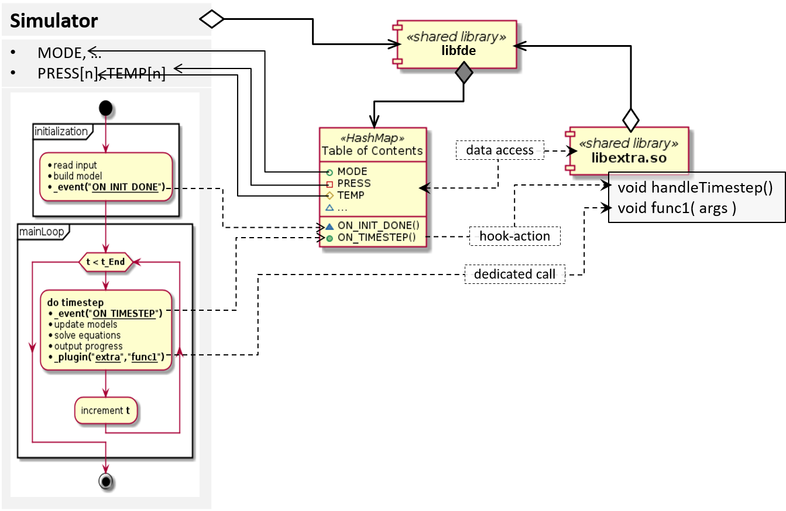

Fortran Development Extensions (libfde)
=======================================

.. contents::

About
-----

The extension of legacy code often presents developers with big challenges.
Particularly in case of Fortran code, the implementation of newer software concepts requires a great effort, very good understanding
of language concepts (fixed format, f77, implicit declaration, etc.) and the legacy code, which is often way beyond the scope of many projects.
For this reason, new software projects often try to integrate old, thoroughly tested but yet unmaintained code, as-is.
However, even this approach turns out to be difficult enough in practice.
Aside from other issues, it's likely that signatures of routines have to be changed to make them externally available to languages that follow
the C-conventions, what is often not as straight forward as it seems.
Such simple modifications allow calling the code, but they alredy hold certain danger of introducing bugs!
Allowing even extended data exchange or advanced control over code execution require a lot more effort, care and testing.

The "lessons learned" from a number of Fortran-based projects of recent years have been combined into this library, with the aim of facilitating
the integration and control of legacy Fortran codes.
The included techniques make it possible to use such codes virtually unchanged, but still make it accessible for data exchange and process control.
The underlying concepts of handling legacy codes are described in the sections below, using the example of some generic simulator code but their principles can be applied many other codes.

As a result, software techniques such as using generic and heterogeneous data structures, event-based control, exception handling, and dynamic reload
of code parts (aka plugins) are possible even within the narrow confines of Fortran.
The library furthermore provides a python package (ctypes-based) that allows to load and use Fortran codes compiled as shared libraries within python.

Why coupling simulation code?
-----------------------------

Objectives:
***********
* extend domain of applying simulation code
* combine expertise of independently developed software packages to solve larger problems

  * make use of other software packages
  * get used by other software packages
  
* **allow interdisciplinary use of simulation code!**

 
Needs what?
***********
* communication between individual software packages

  * data exchange, execution control
  
* generic, robust and flexible interface

  * exchange arbitrary data efficiently
  * easy scaling / adaption to given situations
  * preferably no-maintenance

Common approach
---------------
How?
****
* Tailor coupling interface **ITF B** as part of simulation code **A**

  * actively interfere with simulation cycle of **A**
  * add code accessing and sending internal data to **B**
  * wait for **B** to respond, write back data
  
* **requires a lot of specific code changes!**

.. image:: docs/coupling_A_B_common_ls.png

Results in ...
**************
* highly specialized coupling

  * extends A to work with B – nothing more.

* little robustness

  * If version of A or B changes, coupling probably stops working!

* little flexibility

  * For working also with C, need another interface that does not interfere with B!

* **multiple specialized versions of simulation code A!**

Alternative approach
--------------------
How?
****
* use toolbox library *(libfde)* to moderate between codes
* instruct simulation code to allow external access

  * access simulation state
  * control simulation flow
  
* **turn simulation codes into team player!**

Results in ...
**************
* simulation code without any knowledge about coupling
* easy communication between individual software packages

  * data exchange, execution control
  
* generic, robust and flexible interface

  * exchange arbitrary data efficiently
  * easy scaling / adaption to given situations
  * requires very little maintenance
  
* **very little coupling code, created easily on demand**

How to make autistic legacy code social?
----------------------------------------

Objectives:
***********
* make authistic legacy code work with others
* modularize monolithic code
* **minimal invasive** code changes

Needs what?
***********
* access to simulation state

  * read/write state data *(time dependent, so when can we access it?)*

* control of execution flow

  * interrupt + continue / escape *(exception)*

* way to trigger functionality implemented outside

  * inject user code *(additional code, e.g. monitoring, logging, ...)*
  * override code by user implementation *(disable internal code)*

Approach:
*********
* Shared library provides toolbox for extending legacy code

  * abstract data references *(keeping type information)*
  * generic data structures *(e.g. List, HashMap, Callback-Pointers, ...)*
  * dynamic loading of shared libraries *(plugins)*
  * exceptions

* Instruct legacy code to build-up *„Table of Contents“*

  * basically HashMap *(string => data reference)*
  * add references to accessible data
  * add named control points in code *(„Hook-Points“)*
  * scan and add available plugins

* Prepare positions in legacy code for calling external code

  * add *„Hook-Calls“* *(optional anonymous functions)*
  * add Plugin-Function-Calls *(optional or mandatory)*

Code Preparations:
******************
1. Use toolbox library in legacy code project

   * best, create separate module for code extensions
   * use Fortran modules
   * link libfde
   * recommended: build legacy code as sheared library (so/dll)
   * ...

2. Instruct legacy code to build-up *„Table of Contents“*

   * create *„TOC-Structure“* to group data into sections
   * link accessible data, variables, arrays, slices, etc.
   * declare events, i.e. names of *(„Hook-Points“)*
   * tell libfde where to scan for available plugins

3. Prepare positions in legacy code for calling external code

   * insert *„Hook-Calls“* at suitable code locations
   * add Plugin-Function-Calls *(optional or mandatory)*

4. Done!

   * Now simulator can be coupled without further changes
   * simulation code can be provided in binary form
   * no big deal when coupling CopyLeft (e.g. LGPL) licensed packages
   * if simulation code is built as shared library, it can be loaded into any
     controller programm (e.g. python script) that implements the coupling code.

Extend simulation code by Plugin:
*********************************
* Create shared library containing user code ...

  * possibly in any C-compatible programming language
    *(currently best support for Fortran)*
    
  * linking only toolbox library libfde

* Accessing simulator data:

  * ask *„Table of Contents“* for data references

* Plugin chooses how its routines are getting called:

  * injected functionality *(no-/one-arg callback functions)*
  * dedicated functionality / override internal functionality
  
    * must match to what simulator expects at certain context:
    
      * name of plugin and function
      * function signature *(return type, argument list)*

* Optional initialization routine:

  * prepare pointers storing references of simulator data
  * register injected functionality at *„Hook-Points“*

Naming
------

The library development started with the idea of providing abstract data types in Fortran, what resulted in naming the library **libadt**.
Meanwhile this focus shifted and it contains a lot more than "just" *abstract data containers*, so it was really necessary to rename it to **libfde** (Fortran Development Extensions) to reflect better it's purpose and the contained functionality.
This prefix change has been done some time ago, but I guess it's still possible that *adt* appears somewhere, e.g. in comments.

Basic principles and state of development
-----------------------------------------

There are other, well-established approaches of making Fortran codes available in Python (e.g. F2PY http://www.f2py.com/).
However, aside from using Fortran codes in Python the mayor goals of libfde comprise a lot more:

- call, control and access data of Fortran code with only minimal invasive changes.
  So using the library and preparing the legacy code should be as simple and modest as possible.
- it should not put restrictions on the toolchain or require a certain Fortran compiler, although in practice **there is** the need of
  using at least a Fortran compiler that provides a reasonable C-preprocessor and f90/f2003-support!
  At least ifort (>= 14.0) and gfortran (>= 4.8) should work fine, without regard to buggy compiler versions
  (Basically the flood of bugs in Fortran compilers is the reason why libfde does not make use of newer Fortran concepts, e.g. classes).
- the exported interfaces are kept C-compatible - however, *not really* ISO Bind C, because this would put far too many restrictions
  on code that just passes strings or structured types to routines.

The library reached a quite stable state and it's used in productive code.
Nevertheless, **a lot** of things can be improved and some aspects need further development.
 
- mainly, the documentation of interfaces and examples!
  (still looking for a good tool for generating it from Fortran-code!!)
- the python interface is not complete
- some constructs should be revised to improve memory efficiency
- some data structures might be way better off being re-implemented in the C/C++ core (libfortres)
- ...

Copyright and License Information
---------------------------------

Copyright (c) 2019 Josef Scheuer.
All rights reserved.

See the file "LICENSE" for terms &
conditions for usage, and a DISCLAIMER OF ALL WARRANTIES.

This library distribution contains **no** GNU General Public License (GPL) code,
so it may be used in proprietary projects.

